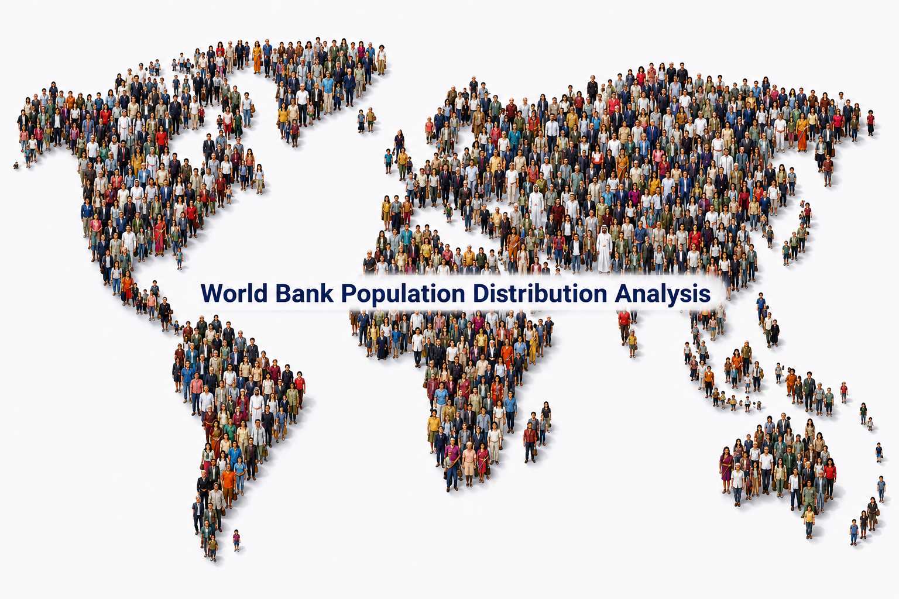

  

# PRODIGY_DS_01

## Task 01 – World Bank Population Distribution Analysis

This project was completed as part of the Data Science Internship at Prodigy InfoTech. The objective of this task was to create visualizations that analyze the distribution of categorical and continuous variables using real-world population datasets.

The dashboard was developed in Power BI using World Bank Open Data to explore global population trends, gender distribution, children population (0–14), migrant population, and income group analysis across countries and decades.

## Objective

Create visualizations such as bar charts and histograms to analyze:
- Total Population
- Male vs Female Population
- Children Population (0–14)
- Migrant Population
- Population Distribution by Income Group

---

## Dataset Source

World Bank Open Data  
https://data.worldbank.org/indicator/SP.POP.TOTL

---

## Tools & Technologies Used

- Power BI
- Power Query
- DAX (Data Analysis Expressions)
- Data Cleaning & Transformation

## Dashboard Highlights

- Population trend analysis from 1960–2024
- Male vs Female population comparison by decade
- Children (0–14) population distribution by decade
- Global migrant stock trend (1990–2024)
- Income group population segmentation using treemap
- Interactive slicers for Decade, Country, Region and Income Group
- KPI cards for quick summary statistics

---

## Key Insights

- Population density and growth patterns vary significantly across income groups.
- Developing economies show stronger long-term population expansion trends.
- Child population remains concentrated in highly populated nations.
- Population trends highlight gradual demographic shifts across decades.
- Regional migration patterns indicate increasing global mobility over time.

---

## Files Included

- Dashboard Screenshot
- README.md
- LICENSE
 
---

## Dashboard Preview

## Internship Details

**Organization:** Prodigy InfoTech  
**Internship:** Data Science  
**Task 01:** Create a bar chart or histogram to visualize the distribution of a categorical or continuous variable, such as the distribution of ages or genders in a population.

## LinkedIn

🔗https://www.linkedin.com/feed/update/urn:li:activity:7466146245120790528/
---

## Author
**Tanushree Mazumdar**

This project was created for educational and internship purposes under Prodigy InfoTech.

